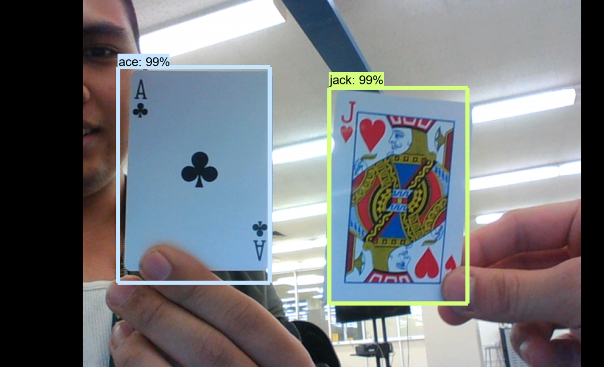

# Computer Vision for Playing Cards

Abstract
---
  This project is a real time image classifier of playing cards. Our aim is to take a live camera feed, and identify the parts of it where there are cards, and identify which cards those are, both in real time. To do this, we use convolutional neural networks and computer vision packages. We use the faster Region-Convolutional Neural Network algorithm to accomplish this, specifically the package provided by Tensorflow, faster-rcnn-inception-v2. The data we used was obtained by taking many images of cards in various relative positions with various backgrounds, and then using a labelling software to manually identify the cards. Training the algorithm on this data would allow us to create a product.
  
  Eventually, we hope to program into the system the ability for it to play card games like poker, which will allow it to participate in games though needing a human to carry out instructions.

Contributors
---
- Fluellen Arman Umali
- Edward Zhong

Motivation
---
A strong interest in computer vision lead us to the idea for this project. Growing up as a young lad in the California Bay Area, I always saw self-driving cars being tested, and I wondered how they would work. Learning computer vision through a card project would provide insight into how it does function, and although driving is undoubtedly more complicated than playing a card game, perhaps learning how cards are detected and differentiated can allow us to begin to see how a car detects people and lines on the road. Additionally, building a program that can play a card game given only a video feed would be a very interesting project in itself, and would provide a fine result.

Methodology
---
Data Collection
- We gather our data by taking a few thousand images of cards on an IPhone 10. Each image had one or multiple cards arranged in different positions, and moving around to different locations, we were able to get them to all have varying backgrounds. We then uploaded the images, before resizing them to 720x1080, which compresses each file to less than 200 kB.
- We label our images using labelimg. Labelimg allows one to create boxes that contain a specific class, saving this data as xml files, allowing it to be used as inputs for TensorFlows trainer.
    
Modeling
- We splitted our image data into training and testing directory, with an 80/20 ratio. 
- We used Tensorflow's official models and trained our images on it. The specific model used is Tensorflow's faster-rcnn-inception-v2. We edit the configs of the faster-rcnn to allow for the detection of our specified classes, that being the playing cards value and suits.  

A brief overview of Faster R-CNN
- The faster R-CNN (faster Reigon-Convolutional Neural Network) algorithm is a form of the original CNN that is optimised for object detection rather than image classification. There are three networks that compose the Faster R-CNN, that of the feature map generator, the RPN (Reigonal Proposal Network) and the CNN classifier.
- The first thing to do to an image is to use convolutional neural nets to generate feature maps. This is used in the following steps, and reduces the image to a more managable set of data. 
- The RPN, true to its name, proposes regions of the image where it suspects an object exists. Earlier R-CNN algorithms such as the original and the fast R-CNN use a process called selective searching, which divides the image into very many initial regions, then uses a greedy algorithm to combine those regions into larger ones, before spitting out thousands of candidates. This process can be incredibly slow and its output weak. The RPN, however, replaces this with another neural network that takes in the feature map obtained in the first part, and outputs a number of regions, which likely contain objects. Then, putting this output and the feature map through a ROI pooling layer allows the data to be classified.
- The CNN classifier is the basic Convolutional Neural Network that one uses for image classification. We use the various regions and data obtained by the ROI pooling layer to classify those areas.
- This algorithm, compared to the aforementioned R-CNN and the fast R-CNN is far faster, and its ability to be used in real time is why we chose this to use in our program.
       
Ongoing Progress
---
Currently we have a working prototype, however, there are a number of limitations that will be listed as follows:
- it takes 16 hours to train and it runs very slowly (<1 fps)
- it can only detect 6 classes: 9, 10, J, Q, K, A, without the suits
- it is not completely accurate, the most common issue being confusing different face cards with Jack
- it does not handle overlapped cards very well, often getting them wrong

